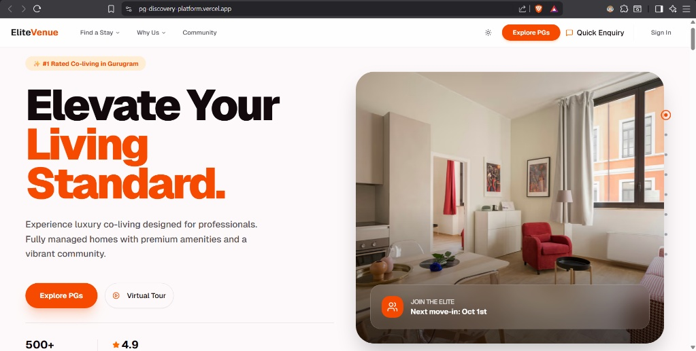
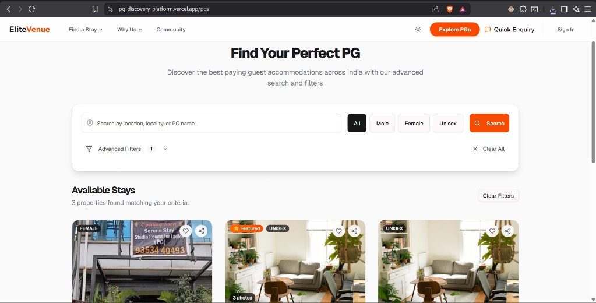
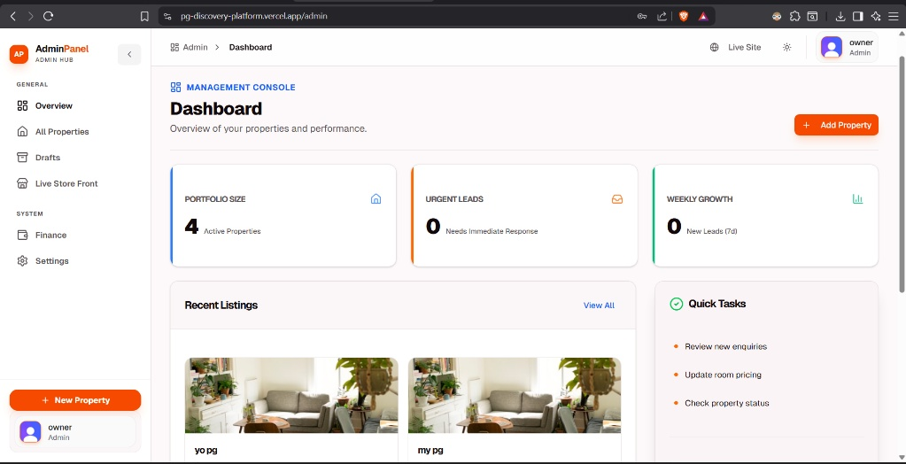
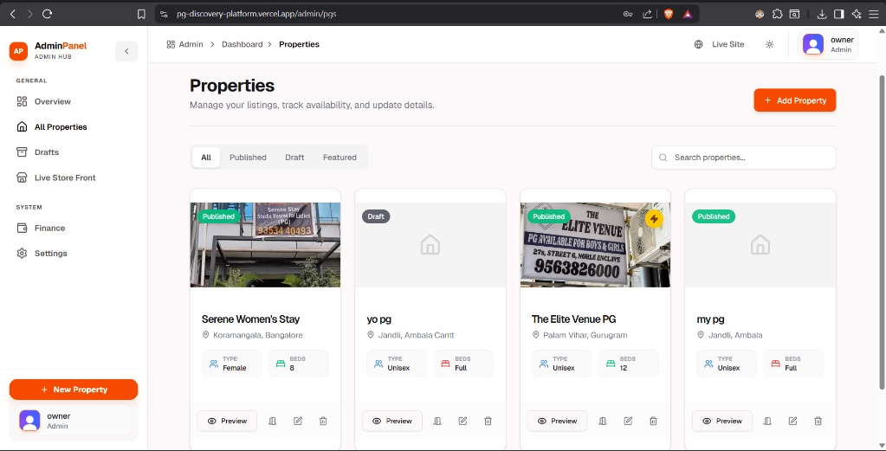

# 📸 PG Discovery Platform - Screenshots

This page contains detailed screenshots of the PG Discovery Platform showcasing various features and user interfaces.

## 🏠 Property Discovery Portal

### Homepage - Property Search

*Detailed property information including photos, room types, pricing, amenities, and contact information.*

### Property Details View

*Browse and search PG accommodations with advanced filtering options including location, price range, and amenities.*

### Search Results

*Filtered search results showing available PG properties with key information and quick actions.*

## 👨‍💼 Owner Dashboard

### Dashboard Overview

*Comprehensive analytics dashboard showing property performance, occupancy rates, inquiries, and revenue metrics.*

### Property Management Interface

*Complete CRUD operations for properties, rooms, and beds with intuitive management interface.*

### Analytics & Insights

*Detailed analytics including occupancy trends, revenue reports, and performance metrics.*

## 📱 Mobile Responsive Design

### Mobile Property Search

*Fully responsive design optimized for mobile devices with touch-friendly interface.*

### Mobile Dashboard

*Mobile-optimized dashboard for property owners on the go.*

### Mobile Property Details

*Mobile property viewing with swipeable image galleries and quick contact options.*

## 👥 Guest Management

### Guest Check-in/Check-out

*Monitor guest stays, preferences, check-in/check-out status, and occupancy management.*

### Guest Profile & History

*Detailed guest information including stay history, preferences, and special requirements.*

## 🔒 Safety & Compliance

### Safety Audit Dashboard

*Track safety features, compliance requirements, and audit schedules for all properties.*

### Audit Form

*Comprehensive safety audit form with category-based checks and status tracking.*

## 💬 Communication & Enquiries

### Enquiry Management

*Manage and respond to property inquiries with automated responses and follow-up tracking.*

### Communication Center

*Integrated messaging system for property owners and potential tenants.*

## 🎨 UI/UX Features

### Dark Mode Support

*Complete dark mode implementation for comfortable viewing in low-light conditions.*

### Interactive Maps

*Interactive map integration for property location visualization and neighborhood exploration.*

### Image Gallery

*Professional image galleries with zoom, fullscreen viewing, and organization features.*

## 🔧 Admin Features

### User Management

*Admin panel for managing users, roles, and permissions across the platform.*

### System Settings

*Platform configuration, integration settings, and system preferences.*

---

## 📷 How to Add Screenshots

1. **Create Directory**: `mkdir public/screenshots`
2. **Capture Screenshots**: Use your preferred screenshot tool
3. **Optimize Images**: 
   - Recommended size: 1200x800px for desktop, 375x667px for mobile
   - Format: PNG or JPG
   - Compress to under 500KB per image
4. **Update Paths**: Replace placeholder paths with actual image filenames
5. **Add Descriptions**: Provide meaningful descriptions for each screenshot

### Screenshot Tools
- **Desktop**: [Snagit](https://www.techsmith.com/snagit), [Lightshot](https://app.prntscr.com/en/index.html)
- **Browser**: [GoFullPage](https://gofullpage.com/), [Awesome Screenshot](https://www.awesomescreenshot.com/)
- **Mobile**: Device screenshots or browser dev tools

---

## 🔄 Keeping Screenshots Updated

Screenshots should be updated when:
- New features are added
- UI/UX improvements are made
- Major design changes occur
- Bug fixes affect visual elements

**Last Updated**: February 2026  
**Platform Version**: 0.1.0 (Phase-0 MVP)
